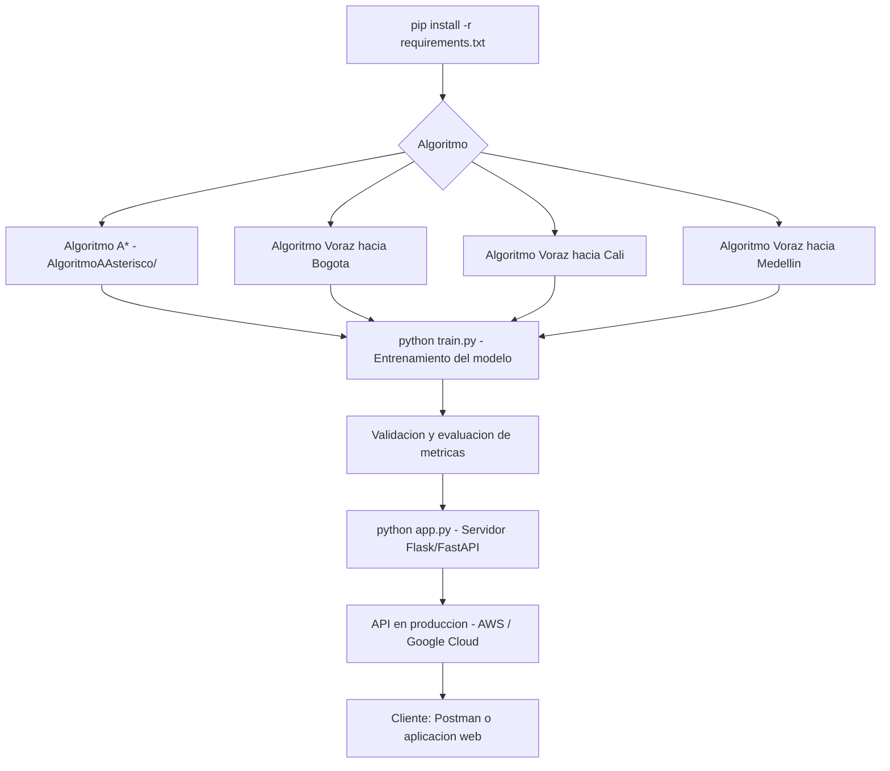

# 📌 Desarrollo y Despliegue de un Proyecto de Inteligencia Artificial - Algoritmos IA  

## 📖 Descripción

---

Este proyecto desarrolla un sistema basado en Inteligencia Artificial para optimizar procesos mediante modelos de aprendizaje automático.

## 🛠️ Funcionalidades  
- Implementación de algoritmos de Machine Learning.  
- Entrenamiento y validación de modelos.  
- Despliegue del modelo en un entorno de producción.  
- Evaluación del rendimiento mediante métricas clave.  

## Arquitectura

## 🚀 Tecnologías utilizadas  
- Python  
- TensorFlow / Scikit-Learn  
- Flask / FastAPI  
- AWS / Google Cloud  

## ▶️ Cómo ejecutar el proyecto  
1. Instalar dependencias con `pip install -r requirements.txt`.  
2. Entrenar el modelo con `python train.py`.  
3. Ejecutar el servidor API con `python app.py`.  
4. Consumir la API desde Postman o una aplicación web.  

## 📌 Autor  
👨‍💻 **Alejandro De Mendoza**

---

## Autor

**Alejandro De Mendoza**  
Ingeniero Informático · Especialista en IA · Especialista en Ingeniería de Software · Máster en Arquitectura de Software

